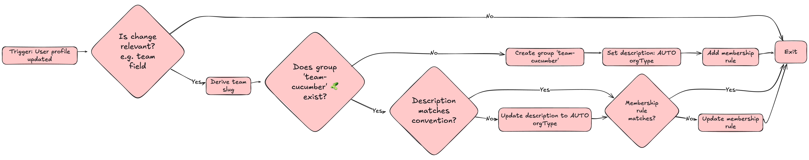
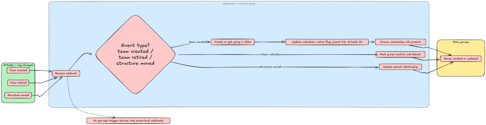
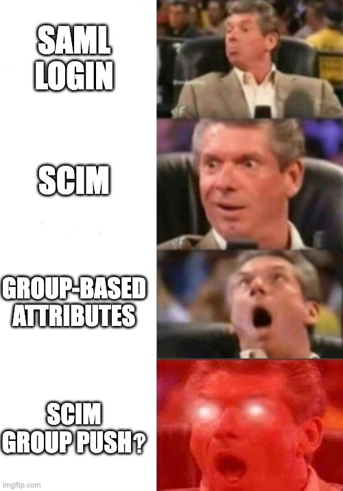

<aside role="note">
  <strong>Takeaway:</strong> we made HRIS the source of truth, let Okta
  Workflows mint and maintain org groups, and pushed that reality into
  Slack, Google, and GitHub. The result is boring on purpose: faster onboarding,
  less drift, and fewer "can you add me to X" tickets for TechOps.
</aside>

## Prelude

We use Okta as our identity tool. Humaans and HiBob are our HRIS and the actual
source of truth. Organisationally our most atomic units are **teams**,
**groups** of teams, and **departments**. Everything else is built on top.

## The problem

Like many companies that get bigger and more complex, we ended up representing
the org structure in a dozen places and none of them were quite right. Google
Groups were kept up to date manually by whoever had the time, the patience, or
got annoyed enough. Slack user groups existed, then drifted, and channel
membership was basically "add people whenever you remember."

Access was not tied to roles or automations in any consistent way. The worst
part was not even the mess. It was the time lost to small manual tasks. New
joiners would land and we would still be nudging them into the right places one
by one. This is busywork masquerading as process.

## The solution

Back in 2022 we did a fair bit of work with Humaans to tighten how provisioning
behaved. The key was getting reliable HRIS data flowing into Okta as attributes,
sometimes default and sometimes custom, so that the user profile actually
reflected reality.

That immediately led to the real problem: how do we automatically create,
update, and retire the groups that represent this structure inside Okta itself,
and then push it to other tools?

### Okta Workflows

The engine runs on top of [Okta Workflows](https://www.okta.com/products/workflows/),
a low-code automation tool similar to Zapier or Workato. It offers native
connectors to different services, lets you create logic, and makes API calls
easy with built-in authentication options like OAuth or bearer tokens.

A flow starts from a trigger, for example a user profile update, a scheduled
run, or an inbound webhook, then moves through predefined actions.

### Version 1

The first iteration was straightforward and a bit loud. We used
`user profile updated` in Okta Workflows as the trigger. Any time HRIS changed a
user's profile, the flow would check:

1. Is this a change we care about, for example the team field?
2. Does `team-cucumber` exist?
3. If not, create it.
4. If it does, validate and exit.
5. If the previous group is empty, archive it.

When creating, we also added a group rule so future membership stayed automatic.
It worked, but it fired for every profile update, which meant noise and a lot of
safeguards to avoid duplication and wasted compute.

We also set conventions so humans and automations could reason about things:
names like `team-cucumber`, and descriptions starting with `AUTO orgType` so you
know a group is managed. A structure was beginning to emerge.

### Version 2

We moved to webhooks and a small control plane. On the HRIS side we already had
Airtable, a hybrid database-spreadsheet tool we use as our self-serve
orchestration layer for org changes, so we tied webhooks to the events that
actually matter: team created, team retired, and structure moved.

Groups in Okta were populated with extra metadata so we could treat and query
them like first-class objects rather than just names:

- an `active` flag
- parent relationships for groups of teams
- the Airtable ID for fast reconciliation

We no longer had to worry about hundreds or thousands of triggers firing.

## The rest

Once Okta had clean, lifecycle-aware groups, the downstream tools got much
easier.

Google, Notion, and Slack were easy wins because SCIM and group push are
available in the OIN apps where supported. Point the automation at anything
matching the convention and it goes.

**Slack has a wrinkle:** if you are on Enterprise Grid, pushed groups land at
the enterprise level, not the workspace, which means you need a bit of API work
to attach them to channels. Not my favourite behaviour change, but it is stable
now. This is exactly why conventions help. You can find and fix things
consistently.

GitHub needed more hands-on work. You can map IdP groups to GitHub Teams, which
is great, but you still have to create the team and link it via API. Worth
doing.

Their API is genuinely pleasant, and once it is linked, drift stops being a
thing. This also unlocked more interesting use cases. Engineering leadership
asked for specialisations for PR reviews, for example a frontend reviewer pool.
We added a `specialisation` attribute in HRIS, let the automations create the
`specialisation-frontend` group, and pushed that into Google and GitHub.

Now any PR can target a group that updates itself, grabbing anyone who is
available. Or a calendar invite can be sent to all frontenders in one click.
Super, super nice.

The other lesson here is visibility. Automation is best when it is invisible,
which unfortunately means people assume nothing is happening. I was personally
guilty of under-documenting this in the past. We are fixing that with a new
initiative in collaboration with our People Tech and Finance Systems friends:
brand-new documentation and demos on what exists, what the names mean, and how a
new attribute gets wired end-to-end.

## The future

There is plenty more to do, and most of it becomes obvious once the foundations
are solid.

Making things **more visible** would be the biggest win. Not everyone needs
Okta admin access to see what a team or department has access to.
[Discord's Access](https://discord.com/blog/access-a-new-portal-for-managing-internal-authorization)
is a particularly interesting project in this space. I can imagine a Slack bot
that messages someone when they change teams to explain what changed and why.

We are also hoping that all of these automation bonuses give us more leverage in
tool procurement: does this expensive SaaS tool support Okta, and if yes, how
well?

We are also trialling and slowly introducing
[OIG](https://help.okta.com/en-us/content/topics/identity-governance/iga.htm)
to enable self-serve access flows and better auditability.

Infra as code remains the North Star. Terraforming parts of the setup and adding
the same kind of branch protection we expect from production code is another
step toward being bulletproof and compliant.

The longer-term point is stability. Reorgs, renames, and new departments should
not be dramatic. With stable IDs, metadata, and naming conventions, those become
attribute updates the system can digest without fuss. The easy wins will always
exist, but the real value is in removing the busywork people stopped noticing.

**The more invisible this gets, the better it is.**

_Disclosure: I used AI to tighten up and format my sometimes rambling thoughts.
Meme generated on imgflip.com. Diagrams created in Excalidraw._
